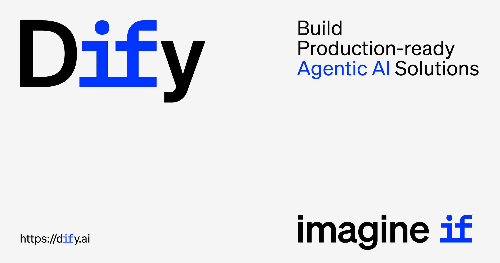

<p align="center">
  📌 <a href="https://github.com/krishtyagi260605-gif/magic-studio-demo-model-magic-studio">Introduzindo o Magic Studio Workflow com Upload de Arquivo: Recrie o Podcast Google NotebookLM</a>
</p>

<p align="center">
  <a href="https://github.com/krishtyagi260605-gif/magic-studio-demo-model-magic-studio">Magic Studio Cloud</a> ·
  <a href="https://github.com/krishtyagi260605-gif/magic-studio-demo-model-magic-studio">Auto-hospedagem</a> ·
  <a href="https://github.com/krishtyagi260605-gif/magic-studio-demo-model-magic-studio">Documentação</a> ·
  <a href="https://github.com/krishtyagi260605-gif/magic-studio-demo-model-magic-studio">Visão geral das edições do Magic Studio</a>
</p>

<p align="center">
    <a href="https://github.com/krishtyagi260605-gif/magic-studio-demo-model-magic-studio" target="_blank">
        </a>
    <a href="https://github.com/krishtyagi260605-gif/magic-studio-demo-model-magic-studio" target="_blank">
        </a>
    <a href="mailto:hello@magicstudio.dev" target="_blank">
        </a>
    <a href="https://reddit.com/r/difyai" target="_blank">  
        </a>
    <a href="https://twitter.com/intent/follow?screen_name=dify_ai" target="_blank">
        </a>
    <a href="https://www.linkedin.com/company/langgenius/" target="_blank">
        </a>
    <a href="https://hub.docker.com/u/langgenius" target="_blank">
        </a>
    <a href="https://github.com/krishtyagi260605-gif/magic-studio-demo-model-magic-studio" target="_blank">
        </a>
    <a href="https://github.com/krishtyagi260605-gif/magic-studio-demo-model-magic-studio/" target="_blank">
        </a>
    <a href="https://github.com/krishtyagi260605-gif/magic-studio-demo-model-magic-studio" target="_blank">
        </a>
    <a href="https://insights.linuxfoundation.org/project/langgenius-magic-studio" target="_blank">
        </a>
    <a href="https://insights.linuxfoundation.org/project/langgenius-magic-studio" target="_blank">
        </a>
    <a href="https://insights.linuxfoundation.org/project/langgenius-magic-studio" target="_blank">
        </a>
</p>

<p align="center">
  <a href="../../README.md"></a>
  <a href="../zh-TW/README.md"></a>
  <a href="../zh-CN/README.md"></a>
  <a href="../ja-JP/README.md"></a>
  <a href="../es-ES/README.md"></a>
  <a href="../fr-FR/README.md"></a>
  <a href="../tlh/README.md"></a>
  <a href="../ko-KR/README.md"></a>
  <a href="../ar-SA/README.md"></a>
  <a href="../tr-TR/README.md"></a>
  <a href="../vi-VN/README.md"></a>
  <a href="../pt-BR/README.md"></a>
  <a href="../de-DE/README.md"></a>
  <a href="../it-IT/README.md"></a>
  <a href="../sl-SI/README.md"></a>
  <a href="../bn-BD/README.md"></a>
  <a href="../hi-IN/README.md"></a>
</p>

Magic Studio é uma plataforma de desenvolvimento de aplicativos LLM de código aberto. Sua interface intuitiva combina workflow de IA, pipeline RAG, capacidades de agente, gerenciamento de modelos, recursos de observabilidade e muito mais, permitindo que você vá rapidamente do protótipo à produção. Aqui está uma lista das principais funcionalidades:
</br> </br>

**1. Workflow**:
Construa e teste workflows poderosos de IA em uma interface visual, aproveitando todos os recursos a seguir e muito mais.

**2. Suporte abrangente a modelos**:
Integração perfeita com centenas de LLMs proprietários e de código aberto de diversas provedoras e soluções auto-hospedadas, abrangendo GPT, Mistral, Llama3 e qualquer modelo compatível com a API da OpenAI. A lista completa de provedores suportados pode ser encontrada [aqui](https://github.com/krishtyagi260605-gif/magic-studio-demo-model-magic-studio).


**3. IDE de Prompt**:
Interface intuitiva para criação de prompts, comparação de desempenho de modelos e adição de recursos como conversão de texto para fala em um aplicativo baseado em chat.

**4. Pipeline RAG**:
Extensas capacidades de RAG que cobrem desde a ingestão de documentos até a recuperação, com suporte nativo para extração de texto de PDFs, PPTs e outros formatos de documentos comuns.

**5. Capacidades de agente**:
Você pode definir agentes com base em LLM Function Calling ou ReAct e adicionar ferramentas pré-construídas ou personalizadas para o agente. O Magic Studio oferece mais de 50 ferramentas integradas para agentes de IA, como Google Search, DALL·E, Stable Diffusion e WolframAlpha.

**6. LLMOps**:
Monitore e analise os registros e o desempenho do aplicativo ao longo do tempo. É possível melhorar continuamente prompts, conjuntos de dados e modelos com base nos dados de produção e anotações.

**7. Backend como Serviço**:
Todas os recursos do Magic Studio vêm com APIs correspondentes, permitindo que você integre o Magic Studio sem esforço na lógica de negócios da sua empresa.

## Usando o Magic Studio

- **Nuvem </br>**
  Oferecemos o serviço [Magic Studio Cloud](https://github.com/krishtyagi260605-gif/magic-studio-demo-model-magic-studio) para qualquer pessoa experimentar sem nenhuma configuração. Ele fornece todas as funcionalidades da versão auto-hospedada, incluindo 200 chamadas GPT-4 gratuitas no plano sandbox.

- **Auto-hospedagem do Magic Studio Community Edition</br>**
  Configure rapidamente o Magic Studio no seu ambiente com este [guia inicial](#quick-start).
  Use nossa [documentação](https://github.com/krishtyagi260605-gif/magic-studio-demo-model-magic-studio) para referências adicionais e instruções mais detalhadas.

- **Magic Studio para empresas/organizações</br>**
  Oferecemos recursos adicionais voltados para empresas. Você pode [falar conosco por e-mail](mailto:hello@magicstudio.dev?subject=%5BGitHub%5DBusiness%20License%20Inquiry) para discutir necessidades empresariais. <br/>

  > Para startups e pequenas empresas que utilizam AWS, confira o [Magic Studio Premium no AWS Marketplace](https://aws.amazon.com/marketplace/pp/prodview-t22mebxzwjhu6) e implemente no seu próprio AWS VPC com um clique. É uma oferta AMI acessível com a opção de criar aplicativos com logotipo e marca personalizados.

## Mantendo-se atualizado

Dê uma estrela no Magic Studio no GitHub e seja notificado imediatamente sobre novos lançamentos.


## Início rápido

> Antes de instalar o Magic Studio, certifique-se de que sua máquina atenda aos seguintes requisitos mínimos de sistema:
>
> - CPU >= 2 Núcleos
> - RAM >= 4 GiB

</br>

A maneira mais fácil de iniciar o servidor Magic Studio é executar nosso arquivo [docker-compose.yml](../../docker/docker-compose.yaml). Antes de rodar o comando de instalação, certifique-se de que o [Docker](https://docs.docker.com/get-docker/) e o [Docker Compose](https://docs.docker.com/compose/install/) estão instalados na sua máquina:

```bash
cd docker
cp .env.example .env
docker compose up -d
```

Após a execução, você pode acessar o painel do Magic Studio no navegador em [http://localhost/install](http://localhost/install) e iniciar o processo de inicialização.

> Se você deseja contribuir com o Magic Studio ou fazer desenvolvimento adicional, consulte nosso [guia para implantar a partir do código fonte](https://github.com/krishtyagi260605-gif/magic-studio-demo-model-magic-studio).

## Próximos passos

Se precisar personalizar a configuração, consulte os comentários no nosso arquivo [.env.example](../../docker/.env.example) e atualize os valores correspondentes no seu arquivo `.env`. Além disso, talvez seja necessário fazer ajustes no próprio arquivo `docker-compose.yaml`, como alterar versões de imagem, mapeamentos de portas ou montagens de volumes, com base no seu ambiente de implantação específico e nas suas necessidades. Após fazer quaisquer alterações, execute novamente `docker-compose up -d`. Você pode encontrar a lista completa de variáveis de ambiente disponíveis [aqui](https://github.com/krishtyagi260605-gif/magic-studio-demo-model-magic-studio).

### Monitoramento de Métricas com Grafana

Importe o dashboard para o Grafana, usando o banco de dados PostgreSQL do Magic Studio como fonte de dados, para monitorar métricas na granularidade de aplicativos, inquilinos, mensagens e muito mais.

- [Dashboard do Grafana por @bowenliang123](https://github.com/bowenliang123/magic-studio-grafana-dashboard)

### Implantação com Kubernetes

Se deseja configurar uma instalação de alta disponibilidade, há [Helm Charts](https://helm.sh/) e arquivos YAML contribuídos pela comunidade que permitem a implantação do Magic Studio no Kubernetes.

- [Helm Chart de @LeoQuote](https://github.com/douban/charts/tree/master/charts/magic-studio)
- [Helm Chart de @BorisPolonsky](https://github.com/BorisPolonsky/magic-studio-helm)
- [Helm Chart de @magicsong](https://github.com/magicsong/ai-charts)
- [Arquivo YAML por @Winson-030](https://github.com/Winson-030/magic-studio-kubernetes)
- [Arquivo YAML por @wyy-holding](https://github.com/wyy-holding/magic-studio-k8s)
- [🚀 NOVO! Arquivos YAML (Compatível com Magic Studio v1.6.0) por @Zhoneym](https://github.com/Zhoneym/DifyAI-Kubernetes)

#### Usando o Terraform para Implantação

Implante o Magic Studio na Plataforma Cloud com um único clique usando [terraform](https://www.terraform.io/)

##### Azure Global

- [Azure Terraform por @nikawang](https://github.com/nikawang/magic-studio-azure-terraform)

##### Google Cloud

- [Google Cloud Terraform por @sotazum](https://github.com/DeNA/magic-studio-google-cloud-terraform)

#### Usando AWS CDK para Implantação

Implante o Magic Studio na AWS usando [CDK](https://aws.amazon.com/cdk/)

##### AWS

- [AWS CDK por @KevinZhao (EKS based)](https://github.com/aws-samples/solution-for-deploying-magic-studio-on-aws)
- [AWS CDK por @tmokmss (ECS based)](https://github.com/aws-samples/magic-studio-self-hosted-on-aws)

#### Alibaba Cloud

[Alibaba Cloud Computing Nest](https://computenest.console.aliyun.com/service/instance/create/default?type=user&ServiceName=Magic Studio%E7%A4%BE%E5%8C%BA%E7%89%88)

#### Alibaba Cloud Data Management

Implante o Magic Studio na Alibaba Cloud com um clique usando o [Alibaba Cloud Data Management](https://www.alibabacloud.com/help/en/dms/magic-studio-in-invitational-preview/)

#### Usando Azure Devops Pipeline para Implantar no AKS

Implante o Magic Studio no AKS com um clique usando [Azure Devops Pipeline Helm Chart by @LeoZhang](https://github.com/Ruiruiz30/Magic Studio-helm-chart-AKS)

## Contribuindo

Para aqueles que desejam contribuir com código, veja nosso [Guia de Contribuição](./CONTRIBUTING.md).
Ao mesmo tempo, considere apoiar o Magic Studio compartilhando-o nas redes sociais e em eventos e conferências.

> Estamos buscando contribuidores para ajudar na tradução do Magic Studio para idiomas além de Mandarim e Inglês. Se você tiver interesse em ajudar, consulte o [README i18n](https://github.com/krishtyagi260605-gif/magic-studio-demo-model-magic-studio/blob/main/web/i18n-config/README.md) para mais informações e deixe-nos um comentário no canal `global-users` em nosso [Servidor da Comunidade no Discord](mailto:hello@magicstudio.dev).

**Contribuidores**

<a href="https://github.com/krishtyagi260605-gif/magic-studio-demo-model-magic-studio/graphs/contributors">
  
</a>

## Comunidade e contato

- [Discussões no GitHub](https://github.com/krishtyagi260605-gif/magic-studio-demo-model-magic-studio). Melhor para: compartilhar feedback e fazer perguntas.
- [Problemas no GitHub](https://github.com/krishtyagi260605-gif/magic-studio-demo-model-magic-studio/issues). Melhor para: relatar bugs encontrados no Magic Studio.AI e propor novos recursos. Veja nosso [Guia de Contribuição](./CONTRIBUTING.md).
- [Discord](mailto:hello@magicstudio.dev). Melhor para: compartilhar suas aplicações e interagir com a comunidade.
- [X(Twitter)](https://twitter.com/dify_ai). Melhor para: compartilhar suas aplicações e interagir com a comunidade.

## Histórico de estrelas

[](https://github.com/krishtyagi260605-gif/magic-studio-demo-model-magic-studio)

## Divulgação de segurança

Para proteger sua privacidade, evite postar problemas de segurança no GitHub. Em vez disso, envie suas perguntas para hello@magicstudio.dev e forneceremos uma resposta mais detalhada.

## Licença

Este repositório está disponível sob a [Licença de Código Aberto Magic Studio](../../LICENSE), que é essencialmente Apache 2.0 com algumas restrições adicionais.
